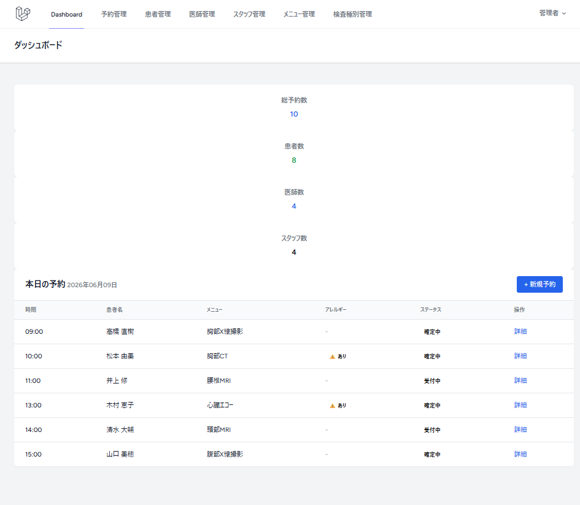
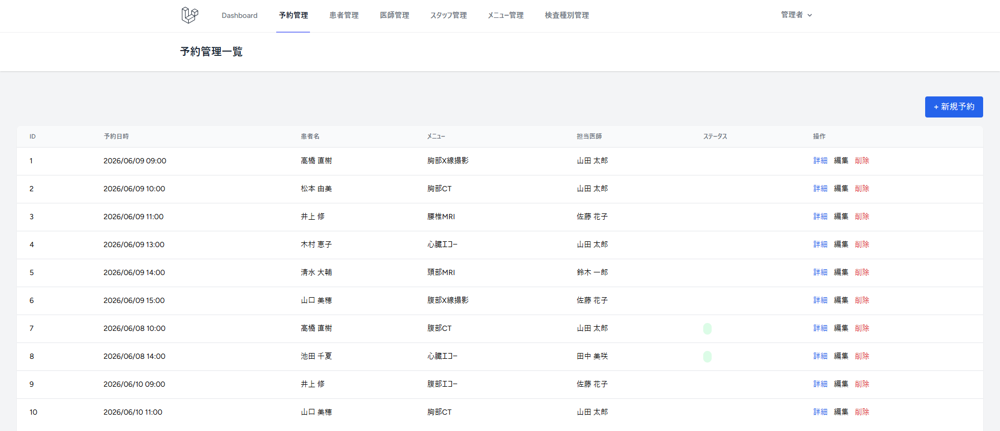
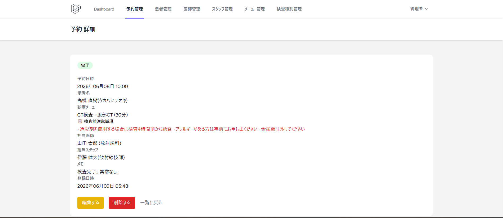

# クリニック予約管理システム

## 概要

放射線技師として医療現場で勤務した経験をもとに設計・開発した、クリニック向けの予約管理Webアプリケーションです。
医療現場で実際に必要とされる機能（アレルギー情報の管理・検査前注意事項の表示など）を盛り込み、現場目線の設計を意識しました。


## スクリーンショット

### ダッシュボード


### 予約管理


### 患者詳細（アレルギー記載あり）



## 使用技術

- PHP：8.3
- Laravel：11
- MySQL：8.4
- TailwindCSS：3系
- Docker | Laravel Sail


## 機能一覧

### 認証機能
- ログイン / ログアウト
- ユーザー登録

### 予約管理
- 予約の登録・編集・削除・一覧・詳細
- ステータス管理（受付中 / 確定 / キャンセル / 完了）

### 患者管理
- 患者の登録・編集・削除・一覧・詳細
- アレルギー・禁忌情報の管理

### 医師管理
- 医師の登録・編集・削除・一覧・詳細

### スタッフ管理
- スタッフの登録・編集・削除・一覧・詳細
- 職種管理（放射線技師 / 看護師 / 受付 / その他）

### 診療メニュー管理
- メニューの登録・編集・削除・一覧・詳細
- 検査種別との紐付け・所要時間・料金管理

### 検査種別管理
- 検査種別の登録・編集・削除・一覧・詳細
- 検査前注意事項の管理（例：CT造影剤使用時の絶食時間など）

### ダッシュボード
- 本日の予約一覧（時間順）
- アレルギーあり患者の強調表示
- 総予約数・患者数・医師数・スタッフ数の集計


## 医療現場目線での設計ポイント

### アレルギー・禁忌情報の管理
造影剤を使用するCT・MRI検査では、アレルギー歴の確認が必須です。
予約詳細・ダッシュボードでアレルギーあり患者を赤バッチで強調表示し、見落としを防ぐ設計にしました。

### 検査前注意事項の自動表示
検査種別ごとに注意事項（例：腹部CT「4時間絶食」、MRI「金属類除去」）を登録できます。
予約詳細画面で自動表示されるため、スタッフが個別に確認する手間が省けます。

### ステータス管理
予約を「受付中⇒確定⇒完了」と段階的に管理できます。
キャンセル履歴もSoftDeletesにより保持されます。

## データベース設計
```
users          ：管理者・スタッフ・医師ログイン情報
patients       ：患者情報（アレルギーメモ含む）
doctors        ：医師情報
staffs         ：スタッフ情報（職種管理）
exam_types     ：検査種別（検査前注意事項含む）
menus          ：診療メニュー（検査種別に紐付く）
reservations   ：予約情報（上記全テーブルに紐付く）
```


## 工夫した点
- 放射線技師としての現場経験をもとに、実務で必要な項目を設計に反映しました。
- SoftDeleteを全テーブルに導入し、削除データの復元・履歴管理を可能にしました。


## 作者について

放射線技師として医療現場での経験を経た後、Webエンジニアへのキャリアチェンジを目指しています。
医療×ITという専門性を活かし、医療系システムの開発・改善に貢献したいと考えております。


## ローカル環境での起動方法

```bash
# リポジトリのクローン
git clone https://github.com/masa376/clinic-reservation.git
cd clinic-reservation

# 環境変数の設定
cp .env.example .env

# Sailの起動
sail up -d

# 依存パッケージのインストール
sail composer install

# アプリケーションキーの生成
sail artisan key:generate

# マイグレーション実行
sail artisan migrate

# フロントエンドのビルド
sail npm install
sail npm run build

# シーダー実行（デモデータ投入）
sail artisan db:seed
```


### テストアカウント

| 役割 | メールアドレス | パスワード |
|------|-------------|---------|
| 管理者 | admin@clinic.example.com | password |
| スタッフ | ito@clinic.example.com | password |
| 医師 | yamada@clinic.example.com | password |


